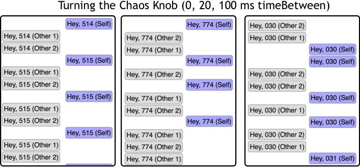

---
title: "Double Down on Testing With RxJS Load Tests"
date: "2017-03-20"
author:
  name: "Dean Radcliffe"
  url: "http://twitter.com/deaniusaur"
tldr:
  title: "RxJS can make for great load tests"
  body: """
Learn some strategies for testing with this example of RxJS code that tests a WebSocket-based site.
        """
---

At Test Double, we love to test. Know about the Testing Pyramid, and use it. And, we'll roll our own testing code if we need to.

Now- much of the testing pyramid focuses on correctness. Has Pass / Fail outcomes. Even aims to affect naming in pieces of code. Yet, sites with tons of these tests still fail in production - why? Every test they have is still screaming 'Green', while the email boxes fill up with complaints. Enter Load Testing, the orphan step-child of the testing suite. 

Load testing deals not in black and white, but shades of gray, and pesky floating point numbers. It can be tricky to write - it's some of the most concurrent, distributed, error-tolerant code you'll ever need to write! And that's why, when my toolchest of common testing tools failed to produce a fit to my latest testing problem, I relished the chance to whip one up myself. Fortunately it took less than half a day until these tests revealed their dividends.

Here's how this bad-boy looked, configured to 4 agents, 12 tasks each.


* TODO Describe what to look for in these results, and why 'average' is a useless statistic]

```
Tests completed  cleanly YAY!
Timings:
 [ 59, 73, 82, 63, 60, 75, 66, 71, 76, 55, 61, 65, 64, 59, 54 ]
Results:
 {
  "success": 15,
  "error": 0,
  "average": 65.53333333333333,
  "stdev": 8.219025547617003,
  "max": 82,
  "80th%": 73.4,
  "99th%": 81.16
}
```

* TODO Describe the parameters, including the 'Chaos Knob', simulating longer network segments more subject to delay.



* TODO Describe the code [here](https://gist.github.com/deanius/6284d7b8d634b6f0bb8ae28a063a21a1#file-loadtest-js ), and how to plug in your own promise-returning testing function, tweak parameters, etc.

* TODO Describe some existing non-custom solutions like `ab`]
